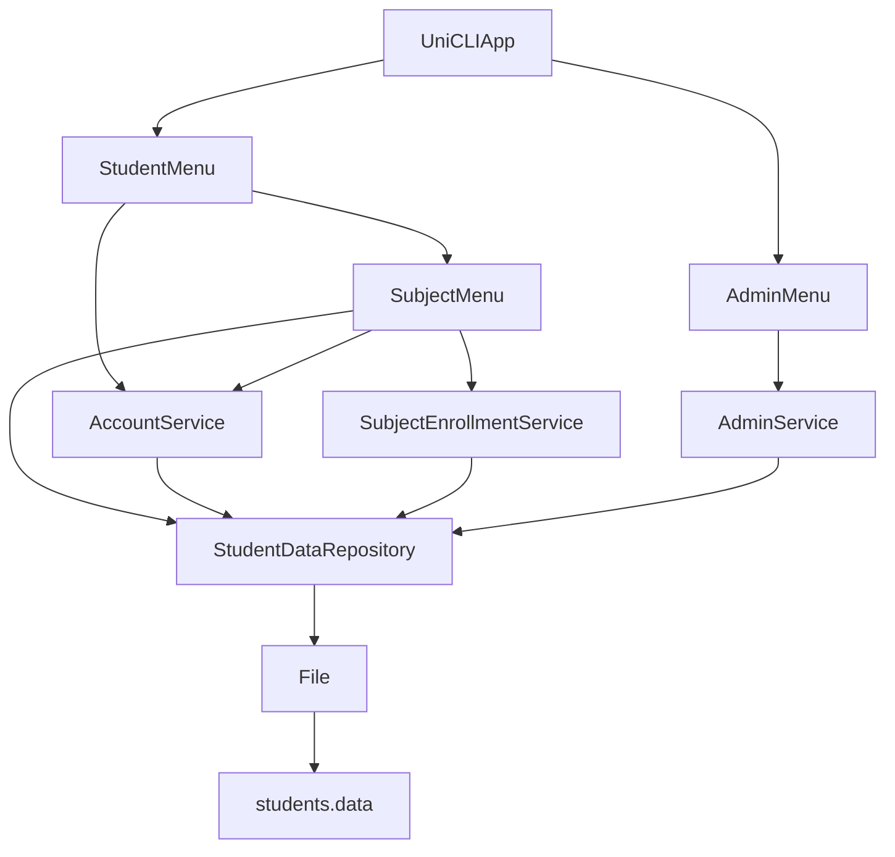
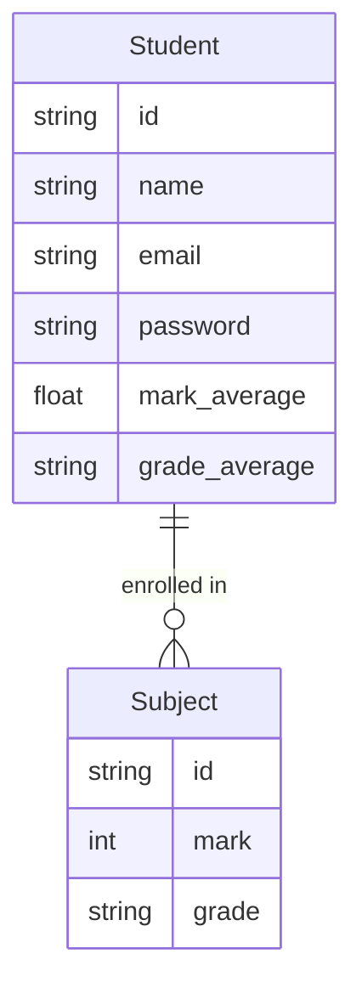

# UniCLI App

A command-line university management system built with a layered architecture.

## Running

```bash
python uni_cli_app.py
```

## Architecture



## Entity Relationships



## Module Overview

| Layer | Module | Responsibility |
|---|---|---|
| Entry Point | `uni_cli_app.py` | Wires dependencies, starts app via `UniCLIApp().run()` |
| UI | `student_menu.py` | Register and login flow |
| UI | `subject_menu.py` | Subject enrolment, password change, view subjects |
| UI | `admin_menu.py` | View, group, partition, remove students |
| Service | `account_service.py` | Register, login, change password |
| Service | `subject_enrollment_service.py` | Enrol and remove subjects |
| Service | `admin_service.py` | Admin operations, student grouping and partitioning |
| Repository | `student_data_repository.py` | CRUD operations, returns `Student` instances |
| IO | `file.py` | JSON file read/write |
| Model | `student.py` | Student entity with result calculation |
| Model | `subject.py` | Subject entity with grade derivation |
| Utility | `utils.py` | `pad_number`, `grade_from_mark`, `input_text` |
