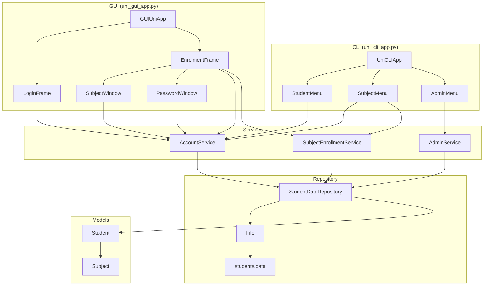
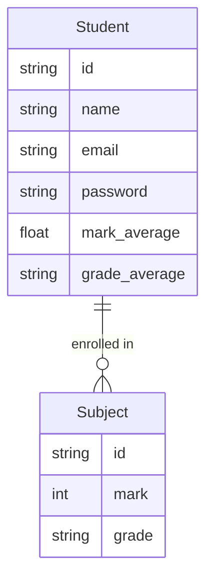

# UniApp

A university management system with both CLI and GUI interfaces, built with a layered architecture.

## Running

```bash
# CLI
python uni_cli_app.py

# GUI
python uni_gui_app.py
```

## Architecture



## Entity Relationships



## Module Overview

| Layer | Module | Responsibility |
|---|---|---|
| CLI Entry Point | `uni_cli_app.py` | `UniCLIApp` state machine, `StudentMenu`, `SubjectMenu`, `AdminMenu` |
| GUI Entry Point | `uni_gui_app.py` | `GUIUniApp` state machine, `LoginFrame`, `EnrolmentFrame`, `SubjectWindow`, `PasswordWindow` |
| Service | `account_service.py` | Register, login, change password, student lookup |
| Service | `subject_enrollment_service.py` | Enrol and remove subjects |
| Service | `admin_service.py` | Admin operations, student grouping and partitioning |
| Repository | `student_data_repository.py` | CRUD operations, returns `Student` instances |
| IO | `file.py` | JSON file read/write |
| Model | `student.py` | Student entity with result calculation |
| Model | `subject.py` | Subject entity with grade derivation |
| Utility | `utils.py` | `pad_number`, `grade_from_mark`, `input_text` |
| Utility | `printer.py` | Coloured terminal output via `Printer` static methods |
